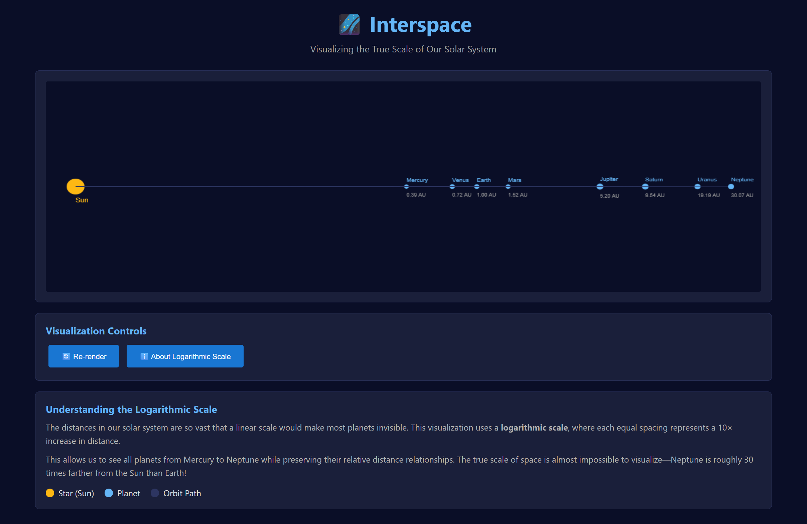

## Intro

Interspace is a solar system distance visualiser built with Rust+WASM. This project is a reconstruction/modernisation of a project I originally worked on for my computer graphics class ~2021.

## Features

- Option to use a logarithmic scaling algorithm to compress astronomical distances
- Drawing circles, lines, and text from WASM

## Why

Because:

> “Space is big. You just won't believe how vastly, hugely, mind-bogglingly big it is. I mean, you may think it's a long way down the road to the chemist's, but that's just peanuts to space.” - Douglas Adams, The Hitchhiker's Guide to the Galaxy

## Preview (WIP)

## License

[MIT](LICENSE.md)